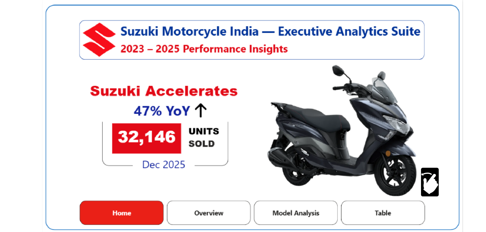
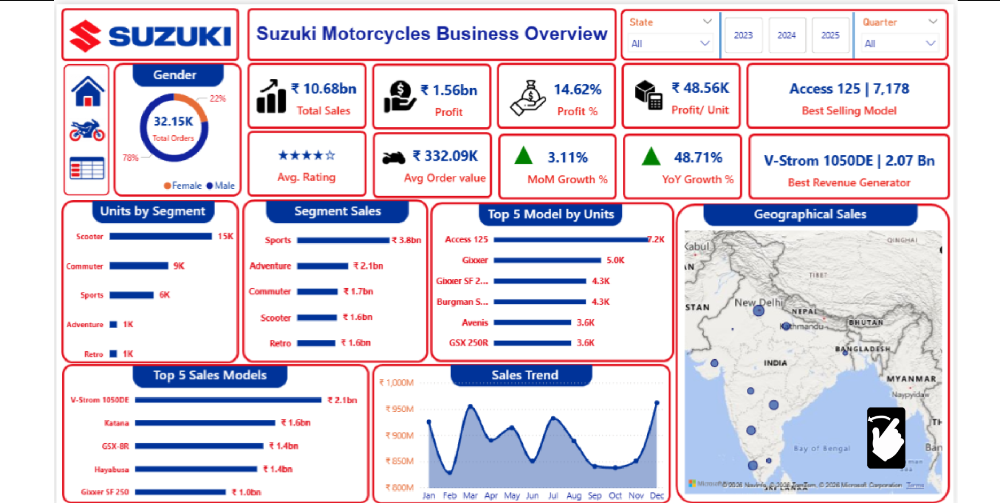
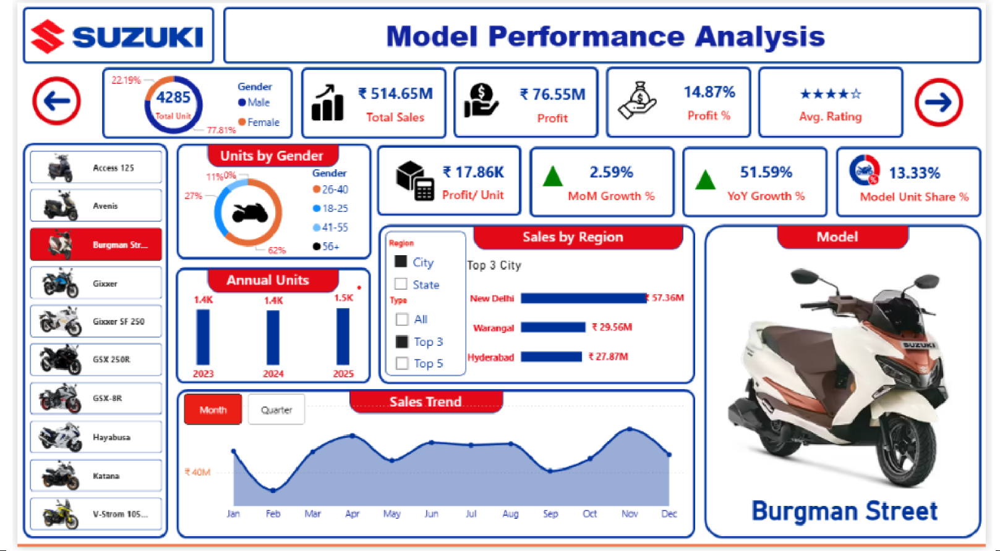
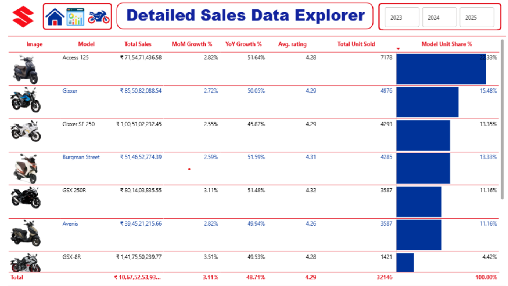

# 🏍️ Suzuki Motorcycle Sales Dashboard | Power BI

---

# 📌 Project Overview

The **Suzuki Motorcycle Sales Dashboard** is an interactive Business Intelligence dashboard developed in **Power BI** to analyze Suzuki Motorcycle India's sales performance from **2023–2025**.

The dashboard enables users to explore business performance across products, customer segments, regions, and time using interactive visuals, filters, and DAX-powered KPIs.

---

# 🖼 Dashboard Preview

## 🏠 Home Page

The landing page provides a quick overview of the dashboard with interactive navigation and highlights the latest business performance.

---

## 📊 Executive Overview

### Highlights

- Total Sales
- Total Profit
- Profit %
- Profit per Unit
- Average Rating
- Average Order Value
- MoM Growth
- YoY Growth
- Best Selling Model
- Highest Revenue Model
- Segment Analysis
- Geographical Sales
- Sales Trend
- Dynamic Filters

---

## 🏍️ Model Performance Analysis

This page allows users to analyze every motorcycle model individually.

### Features

- Model Selection
- Model Image
- Model KPIs
- Annual Units
- Sales Trend
- Regional Sales
- Gender Distribution
- Profit Analysis
- Unit Share
- Growth Analysis

---

## 📋 Detailed Sales Explorer

A fully interactive table for detailed analysis.

Includes:

- Motorcycle Images
- Sales
- Units Sold
- Average Rating
- MoM Growth
- YoY Growth
- Market Share
- Sorting
- Scrolling
- Dynamic Year Filter

---

# 🎯 Objectives

- Analyze sales performance from 2023–2025
- Track profitability
- Identify top-selling motorcycle models
- Analyze customer demographics
- Understand regional sales
- Monitor sales trends
- Build an executive reporting solution

---

# 📊 Key KPIs

- 💰 Total Sales
- 💵 Total Profit
- 📈 Profit %
- 📦 Profit per Unit
- ⭐ Average Rating
- 🛒 Average Order Value
- 🚀 MoM Growth
- 📈 YoY Growth
- 🏍️ Units Sold
- 📊 Model Market Share

---

# 🔍 Key Insights

- 🏆 **Access 125** emerged as the best-selling motorcycle by units sold.
- 💰 **V-Strom 1050DE** generated the highest revenue.
- 📈 Strong Year-over-Year and Month-over-Month growth across multiple models.
- 🌍 Regional analysis identified the highest-performing cities and states.
- 👥 Customer segmentation revealed purchasing patterns by gender.
- 📊 Interactive filters enable quick business exploration.

---

# 🛠 Tools & Technologies

- Power BI Desktop
- Power Query
- DAX
- Data Modeling
- Data Visualization
- Business Intelligence
- Interactive Navigation

---

# 💡 Skills Demonstrated

- Dashboard Design
- Business Intelligence
- DAX
- Power Query
- Data Modeling
- KPI Design
- Executive Reporting
- Data Visualization
- Storytelling with Data

---

# 📂 Dashboard Features

- ✔ Executive Dashboard
- ✔ Model Analysis
- ✔ Regional Insights
- ✔ Sales Trend Analysis
- ✔ Customer Segmentation
- ✔ Interactive Navigation
- ✔ Dynamic Filters
- ✔ Drill-down Analysis
- ✔ Detailed Sales Explorer

---

# 🚀 Business Value

This dashboard helps stakeholders to:

- Monitor overall business performance
- Compare motorcycle models
- Track profitability
- Identify high-performing regions
- Analyze customer behavior
- Support data-driven business decisions

---

# 👨‍💻 Author

**Aqsa Jabein Jawaid**

If you found this project useful, consider giving the repository a ⭐.